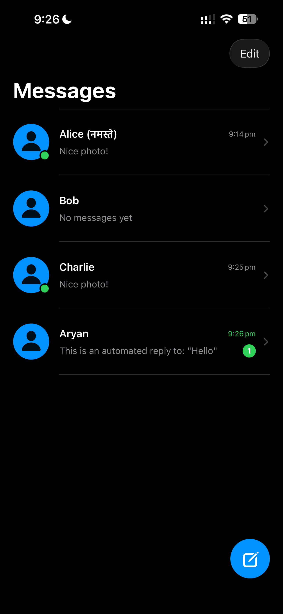
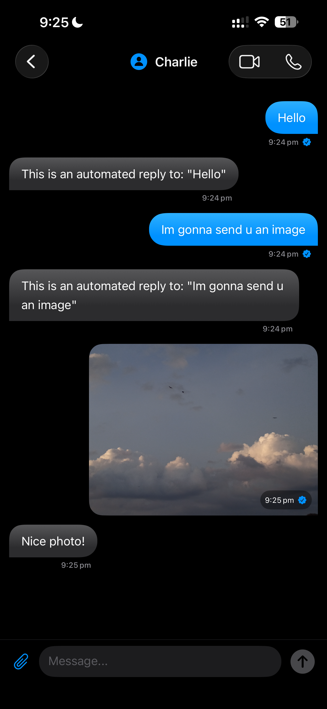
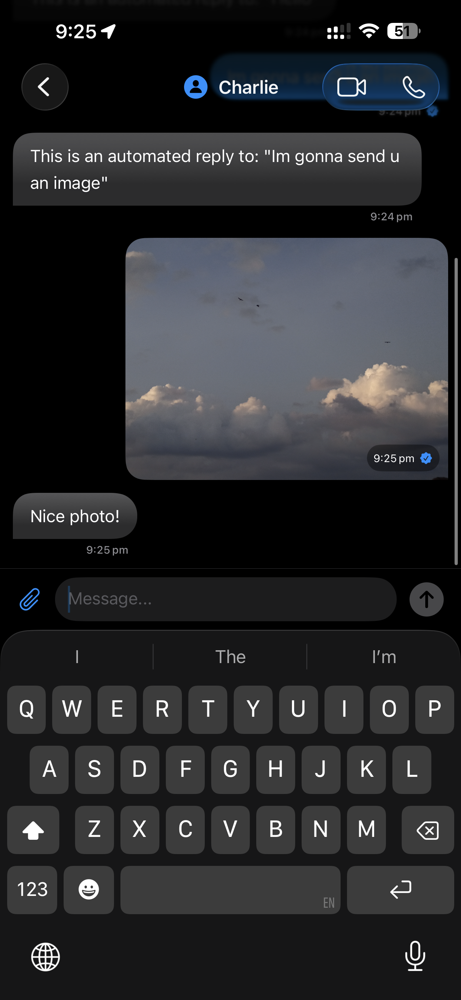
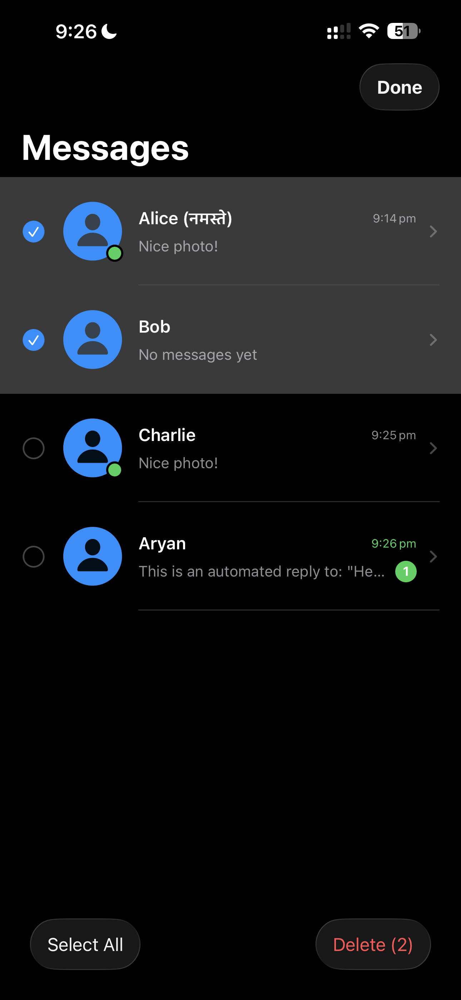
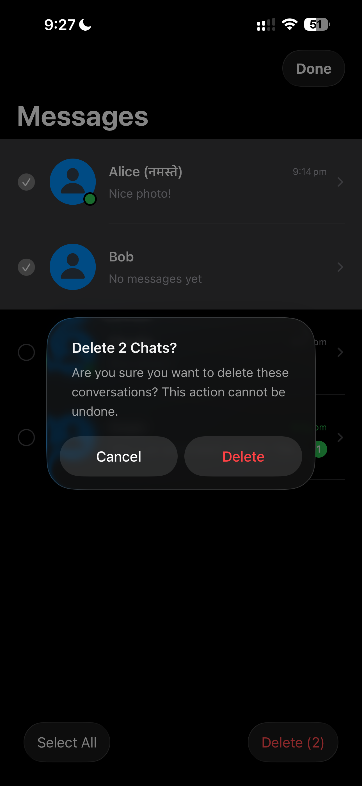

# TufChat: High-Fidelity SwiftUI Chat Prototype

TufChat is a polished, native iOS messaging application built with **SwiftUI** following strict **MVVM architecture**. It features a premium "Liquid Glass" design system, persistent message history, and advanced user interactions like multi-select editing and contextual peeks.

## 🚀 Key Features

- **Advanced Messaging Interface**: Real-time message bubbles with custom shapes, gradients, and dynamic timestamps.
- **Multi-Media Support**: Integrated `PhotosPicker` for sending high-resolution images with automatic bubble clipping.
- **Persistent Storage**: Robust `UserDefaults` implementation with stable UUIDs ensures chat history survives app restarts.
- **Bulk Management (Edit Mode)**: Native "Select-to-Delete" workflow with a dedicated bottom toolbar for managing multiple conversations.
- **Contextual Interactions**: Long-press any chat for a **live preview** of the conversation and quick-action menus.
- **Adaptive UI**: Fully optimized for Light and Dark modes using frosted glass (`.material`) effects and system-adaptive colors.
- **Intuitive Navigation**: Smart "Scroll to Bottom" detection and interactive keyboard dismissal.

---

## 📸 Screenshots

| 1. Homepage & List | 2. Rich Chat Thread | 3. Quick Action (FAB) |
| :---: | :---: | :---: |
|  |  |  |
| *View all active conversations with unread badges and last message previews.* | *Send texts and photos with real-time read receipts.* | *Quickly compose new messages using the floating action button.* |

| 4. Compose Message | 5. Edit Mode | 6. Native Alerts |
| :---: | :---: | :---: |
|  |  |  |
| *Seamlessly start new threads with any contact.* | *Bulk select and manage chats using the native selection toolbar.* | *Safety first: All destructive actions are guarded by native confirmation alerts.* |

---

## 🛠 Technical Implementation

### Architecture (MVVM)
- **Model**: `ChatUser` and `Message` structs conforming to `Codable` and `Identifiable`.
- **ViewModel**: `ChatViewModel` manages the central source of truth, handling message filtering, automated replies, and persistence logic.
- **Views**: Highly modularized SwiftUI components (e.g., `MessageBubble`, `ContactRowView`) to ensure performant rendering and clean code.

### Deep Native Integration
- **PhotosUI**: Utilizes modern `PhotosPicker` for secure, native image selection.
- **GeometryReader**: Custom preference keys are used to track scroll offsets for the "Jump to Bottom" button.
- **Environment Values**: Leverages native `editMode` to synchronize selection states across the List.

---

## 👨‍💻 Developer Notes
Developed with a focus on **Premium Aesthetics** and **Responsive UX**. The project demonstrates mastery of SwiftUI's state management, complex layouts, and native component integration.

*Created for technical assessment submission.*
